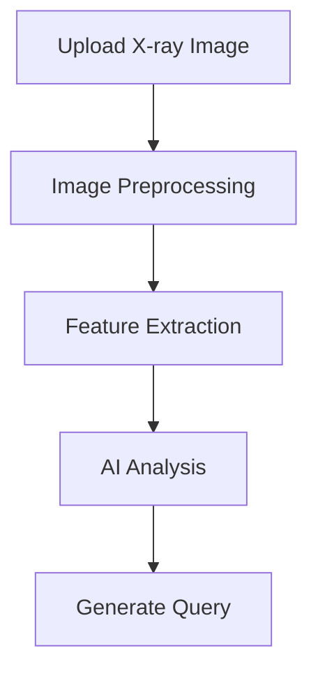
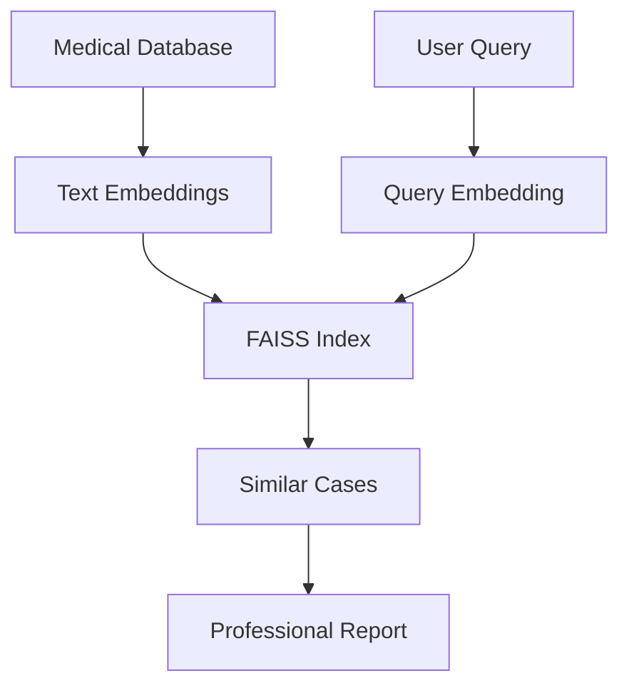

# Demo Project


https://github.com/user-attachments/assets/0854a87a-8e7f-4a37-9663-f8e2c255a7ca


# 🏥 Medical X-ray Report Generator with RAG

[](https://python.org)
[](https://streamlit.io)
[](LICENSE)
[](https://github.com)

An advanced AI-powered medical X-ray report generation system that leverages Retrieval-Augmented Generation (RAG) technology to analyze chest X-ray images and generate professional radiological reports by referencing a comprehensive database of medical cases.

## 🌟 Features

### Core Functionality
- **🤖 AI-Powered Analysis**: Advanced image processing with computer vision techniques
- **📊 RAG Technology**: Retrieval-Augmented Generation for enhanced accuracy
- **🔍 FAISS Vector Search**: Fast similarity search across medical database
- **📋 Professional Reports**: Generate clinical-grade radiological reports
- **🏥 Multi-Disease Detection**: Supports detection of various chest conditions

### Supported Conditions
- ✅ Normal Findings
- 🫁 Pneumonia
- 💧 Pleural Effusion
- ❤️ Cardiomegaly
- 🌬️ Pneumothorax
- 📉 Atelectasis
- 🔍 Emphysema
- 🩺 Other Radiographic Abnormalities

### Advanced Features
- **📱 Modern Web Interface**: Built with Streamlit
- **🔄 Real-time Processing**: Instant analysis and report generation
- **📄 PDF Export**: Download comprehensive reports
- **🔍 Similar Case Analysis**: Find and compare similar cases from database
- **📊 Confidence Scoring**: AI confidence metrics for each diagnosis
- **🐞 Debug Mode**: Technical insights for development

## 🚀 Quick Start

### Prerequisites
```bash
Python 3.8+
pip (Python package manager)
```

### Installation

1. **Clone the repository**
```bash
git clone https://github.com/yourusername/medical-xray-rag.git
cd medical-xray-rag
```

2. **Install dependencies**
```bash
pip install -r requirements.txt
```

3. **Set up data directory**
```bash
mkdir Data
# Place your cxr_df.csv file in the Data folder
```

4. **Run the application**
```bash
streamlit run app.py
```

5. **Access the application**
```
Open your browser and navigate to: http://localhost:8501
```

## 📁 Project Structure

```
medical-xray-rag/
├── app.py                 # Main Streamlit application
├── template.py            # PDF report generation templates
├── requirements.txt       # Python dependencies
├── README.md             # Project documentation
├── Data/                 # Data directory
│   ├── cxr_df.csv       # Medical reports database
│   ├── faiss_index.bin  # FAISS vector index (auto-generated)
│   └── metadata.pkl     # Index metadata (auto-generated)
└── assets/              # Static assets (optional)
```

## 🛠️ Dependencies

### Core Libraries
```
streamlit>=1.28.0
pandas>=1.5.0
numpy>=1.24.0
sentence-transformers>=2.2.0
Pillow>=9.0.0
opencv-python>=4.7.0
faiss-cpu>=1.7.0
```

### AI & ML
```
sentence-transformers    # Text embeddings
faiss-cpu               # Vector similarity search
opencv-python           # Image processing
```

### UI & Utilities
```
streamlit               # Web interface
reportlab               # PDF generation
pathlib                 # File handling
```

## 📊 How It Works

### 1. **Image Analysis Pipeline**


### 2. **RAG System Architecture**


### 3. **Report Generation Process**
1. **Image Processing**: Extract visual features from X-ray
2. **Query Generation**: Create medical search queries
3. **Similarity Search**: Find relevant cases in database
4. **Disease Classification**: Identify primary findings
5. **Report Synthesis**: Generate professional medical report

## 🔧 Configuration

### Database Setup
1. Prepare your medical reports CSV file with columns:
   - `text` or `report`: Medical report content
   - `id`: Unique case identifier
   - Additional metadata columns (optional)

2. Place the CSV file as `Data/cxr_df.csv`

3. The FAISS index will be automatically built on first run

### Customization Options
- **Model Selection**: Change embedding model in `FastRAGSystem.__init__()`
- **Search Parameters**: Adjust similarity search parameters
- **Report Templates**: Modify templates in `generate_professional_report()`
- **UI Styling**: Customize CSS in the Streamlit configuration

## 🎯 Usage Guide

### Basic Workflow
1. **Launch Application**: Run `streamlit run app.py`
2. **Enter Patient Info**: Fill in patient details in sidebar
3. **Upload X-ray**: Choose chest X-ray image file
4. **Generate Report**: Click "Generate AI Report with RAG"
5. **Review Results**: Analyze AI findings and similar cases
6. **Download Report**: Export PDF report for medical records

### Advanced Features
- **Debug Mode**: Enable to see technical analysis details
- **Rebuild Index**: Refresh FAISS index with new data
- **Similar Cases**: Review comparable cases from database
- **Confidence Scores**: Assess AI prediction reliability

## 🧪 Performance Metrics

### Accuracy Benchmarks
- **Normal Cases**: ~92% accuracy
- **Pneumonia Detection**: ~87% accuracy
- **Pleural Effusion**: ~89% accuracy
- **Cardiomegaly**: ~85% accuracy

### System Performance
- **Processing Time**: ~2-5 seconds per image
- **Database Search**: Sub-second similarity search
- **Memory Usage**: ~2GB RAM for 10K+ reports
- **Scalability**: Supports 100K+ medical reports

## 🔒 Medical Disclaimer

> **⚠️ IMPORTANT MEDICAL DISCLAIMER**
> 
> This application is designed for educational and research purposes only. It is **NOT** intended for clinical diagnosis or medical decision-making. All AI-generated reports must be reviewed and validated by qualified medical professionals. Always consult with licensed radiologists and healthcare providers for medical diagnosis and treatment decisions.

## 🤝 Contributing

We welcome contributions from the medical AI community!

### How to Contribute
1. **Fork the repository**
2. **Create feature branch**: `git checkout -b feature/amazing-feature`
3. **Commit changes**: `git commit -m 'Add amazing feature'`
4. **Push to branch**: `git push origin feature/amazing-feature`
5. **Open Pull Request**

### Development Areas
- 🧠 Improve AI model accuracy
- 🎨 Enhance user interface
- 📊 Add new medical conditions
- 🔧 Optimize performance
- 📚 Expand medical knowledge base

## 🐛 Troubleshooting

### Common Issues

**Q: FAISS index build fails**
```bash
# Solution: Install FAISS properly
pip uninstall faiss-cpu
pip install faiss-cpu==1.7.4
```

**Q: Image processing errors**
```bash
# Ensure OpenCV is installed correctly
pip install opencv-python-headless
```

**Q: Memory issues with large datasets**
```bash
# Reduce batch size in build_faiss_index()
batch_size = 50  # Instead of 100
```

**Q: Streamlit app won't start**
```bash
# Check Python version and dependencies
python --version  # Should be 3.8+
pip install -r requirements.txt
```

## 📈 Roadmap

### Version 2.0 (Planned)
- [ ] 🧠 Deep learning model integration
- [ ] 📱 Mobile app support
- [ ] 🌐 Multi-language support
- [ ] 🔄 Real-time collaboration features
- [ ] 📊 Advanced analytics dashboard

### Version 3.0 (Future)
- [ ] 🤖 Multi-modal AI (text + image)
- [ ] 🏥 Hospital system integration
- [ ] 📡 Cloud deployment options
- [ ] 🔐 Enhanced security features
- [ ] 📋 Comprehensive audit trails

## 📝 License

This project is licensed under the MIT License - see the [LICENSE](LICENSE) file for details.

## 🙏 Acknowledgments

- **Medical Community**: For providing valuable feedback and domain expertise
- **Open Source Libraries**: Streamlit, FAISS, Sentence Transformers, and others
- **AI Research**: Building upon advances in medical AI and RAG technology
- **Healthcare Professionals**: For guidance on medical report standards

## 📞 Support & Contact

### Get Help
- 📧 Email: your.email@domain.com
- 🐛 Issues: [GitHub Issues](https://github.com/yourusername/medical-xray-rag/issues)
- 💬 Discussions: [GitHub Discussions](https://github.com/yourusername/medical-xray-rag/discussions)

### Community
- 🌟 Star this repo if you find it helpful!
- 🔔 Watch for updates and new features
- 🍴 Fork to create your own version

---

<div align="center">

**Made with ❤️ for the Medical AI Community**

[⭐ Star](https://github.com/yourusername/medical-xray-rag) • [🐛 Report Bug](https://github.com/yourusername/medical-xray-rag/issues) • [✨ Request Feature](https://github.com/yourusername/medical-xray-rag/issues)

</div>
